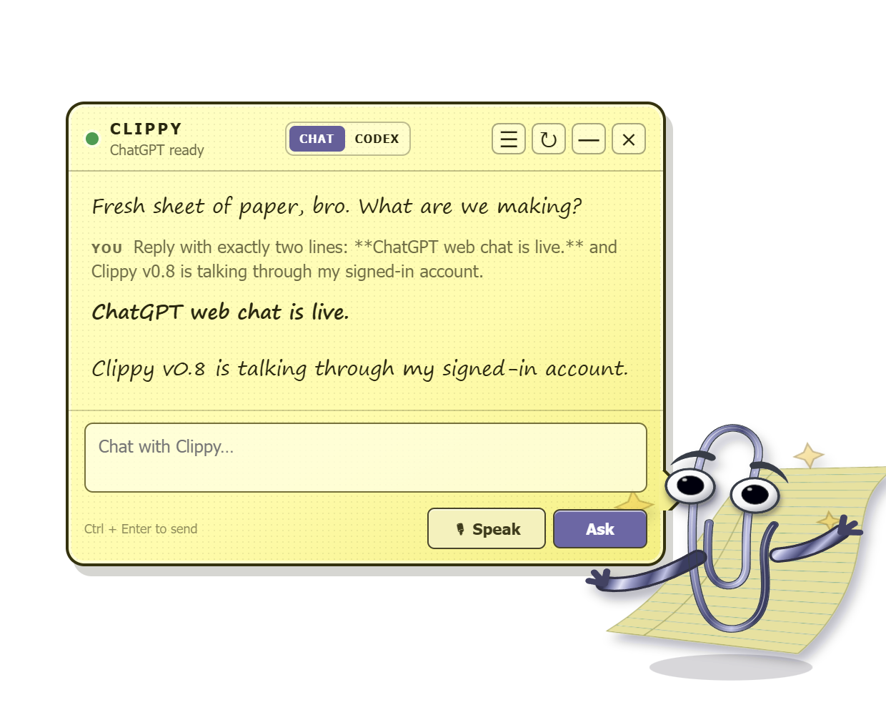

# Codex Clippy

A tiny, always-on-top Windows assistant with a resolution-independent, dynamically rigged SVG Clippy, regular ChatGPT conversation, and a real local Codex app-server mode for computer work.



[Download the latest portable Windows build](https://github.com/xsploit/codex-clippy/releases/latest)

## What it does

- Transparent, always-on-top Electron desktop companion with a dynamically rigged SVG Clippy
- Regular streamed ChatGPT conversation through the account already authenticated by Codex
- Full Codex app-server mode for repositories, tools, approvals, skills, apps, and computer use
- Live model picker in both modes, with Codex reasoning-effort controls
- Codex access profiles for read-only, workspace, or full computer/filesystem access
- File picker, drag-and-drop attachments, image previews, and direct clipboard image pasting
- Existing ChatGPT.com sidebar conversations in Clippy's chat menu, with real history restoration and continuation
- Separate persistent conversation lists for ChatGPT and Codex
- Markdown rendering, microphone dictation, hosted GPT transcription, and local Whisper fallback
- Idle, listening, thinking, searching, working, explaining, success, error, sleeping, and interaction animations

## Run it

Requirements: Windows, Node.js 22+, and a working authenticated `codex` CLI installation. A valid `OPENAI_API_KEY` enables live transcript deltas; Python 3.10 with `faster-whisper` is an optional offline fallback.

```powershell
npm install
npm start
```

Clippy starts in the lower-right corner. Drag the character to move the window, click it to collapse or reopen the speech bubble, and use the tray icon to show, hide, start a new chat, switch modes, or quit. The header has two modes:

- **CHAT** is normal ChatGPT conversation using the ChatGPT account already authenticated by Codex. It does not need an API key. Conversations are saved both in Clippy's local history and to the signed-in ChatGPT account.
- **CODEX** uses `codex app-server` for repository work, tools, approvals, skills, apps, and computer-use capabilities.

The compact controls below the composer come directly from each live backend. Chat mode exposes the model presets currently available to the signed-in ChatGPT account. Codex mode reads `model/list` and `permissionProfile/list` from the installed app server, then exposes model, reasoning effort, and **Read only / Workspace / Full access** selection. The choices persist separately for each mode.

Use **＋** to select one or more files, drop files anywhere on the composer, or paste an image directly from the clipboard. Codex receives images as native `localImage` inputs and other files as path-aware mentions. Chat mode uploads attachments through the signed-in ChatGPT file service and sends image asset pointers or document attachment metadata with the conversation.

The ☰ button opens the separate chat list for the active mode, where earlier conversations can be restored and continued. In Chat mode it merges local Clippy chats with the signed-in account's current ChatGPT.com sidebar and labels their source as **CLIPPY** or **WEB**. Selecting a web chat loads its active message branch and continuation node, so the next message continues the original conversation rather than creating a copy. New ChatGPT chats are materialized locally as soon as they are created, before the first user message.

Assistant responses render Markdown with styled headings, lists, links, tables, blockquotes, and fenced code. Raw HTML stays disabled, and web links open in the system browser instead of navigating the companion window.

Click **Speak**, dictate, then click **Stop mic**. With a valid API key, the microphone streams 24 kHz PCM16 to OpenAI Realtime transcription using `gpt-live-transcribe`; transcript deltas appear in the composer as you talk, and stopping the mic explicitly commits the audio turn. If that route is unavailable, Clippy sends the completed WebM recording through the same authenticated ChatGPT transcription endpoint used by the installed Codex desktop app. Local `faster-whisper` is the last fallback. Dictation never sends the message until you click **Ask** or **Do it**.

Chat mode runs an invisible, sandboxed Electron page inside Clippy. It links that page to the current Codex login, loads the account's current model catalog, performs the same conversation-integrity exchange as the desktop client, uploads selected attachments, and streams the ChatGPT conversation response back to the speech bubble. No Selenium window or separate browser profile is required. This is an undocumented desktop transport isolated behind `src/chatgpt-transport.cjs`, so an OpenAI desktop/web protocol change may require updating that one adapter.

The app launches `codex app-server` over its stable stdio/JSONL transport. Its thread runs in this project folder with on-request approvals and the access profile selected in the composer; **Workspace** is the default. Conversation content remains in Codex's native thread store; Electron only saves the current thread id plus the ids of chats created through Clippy. The current chat is resumed on launch, first prompts become compact chat names, and switching chats uses the real `thread/resume` lifecycle.

## Package it

```powershell
npm run dist
```

The portable executable is written to `dist/`.

## Speech

Speech-to-text is deliberately separate from conversational Codex voice. Electron prefers the official Realtime transcription protocol, while Codex app-server continues owning the coding-agent thread, tools, approvals, and computer-use workflow. The app-server 0.147 experimental transcription mode is not used because it disables turn detection without exposing the required audio-buffer commit operation. The authenticated desktop endpoint is intentionally isolated in the Electron main process: it reads the existing Codex login at request time and never exposes that token to the renderer or saves it in this project. Because that is an undocumented desktop endpoint, it may need adjustment after a Codex app update.

For the optional local fallback, install `faster-whisper` with `py -3.10 -m pip install faster-whisper`; the default model downloads on first use. Set `CODEX_CLIPPY_WHISPER_MODEL` to another faster-whisper model name if desired.

The renderer's completed-turn event in `src/renderer.js` remains the intended seam for Microsoft Sam/SAPI speech output. TTS is deliberately not simulated yet.

## Character rig

The live character uses the project-local Trace 7 SVG geometry, split during extraction into paper, arch, connectors, outer loop, inner loop, individual eyes, and individual pupils. State classes drive synchronized vector timelines for idle, wave, listening, thinking, processing, searching, working, explaining, success, error, clicked, look-down, sleeping, and acknowledgement poses. The original 2x sprite atlas remains in the repository as animation reference and fallback material, but it is not the live renderer.

The original compatibility source is [`pithings/clippy`](https://github.com/pithings/clippy), published as `clippyjs`, a modern rewrite based on the classic Clippy.js extraction. Its code is MIT licensed; Clippy and the character artwork are original Microsoft creations and remain Microsoft's property.
